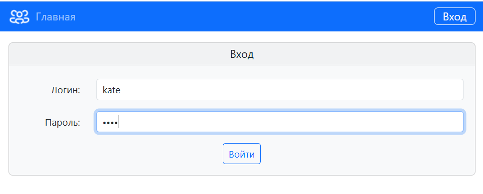
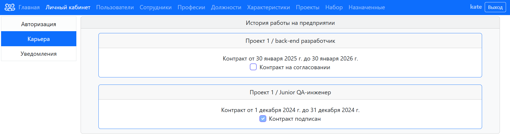
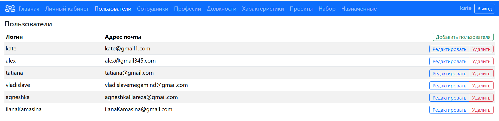
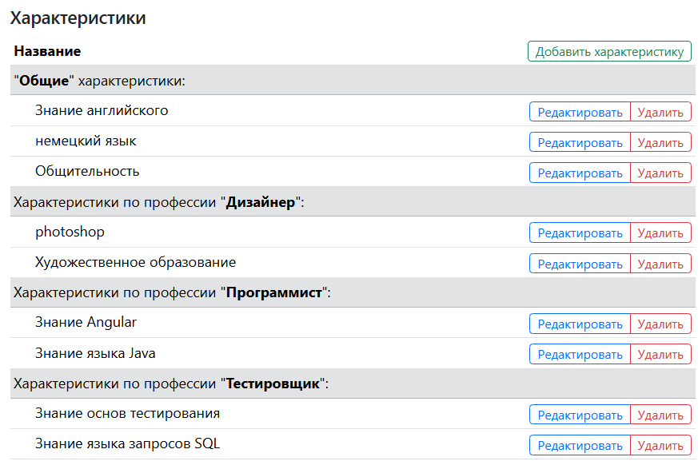
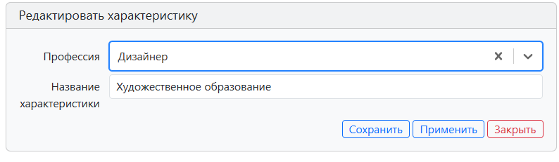
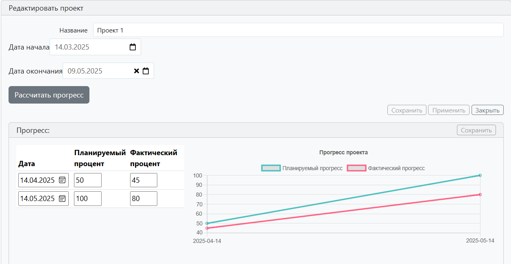
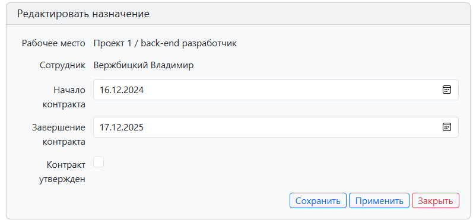

# HRM-system
Application for application for distributing personnel to projects

### Home page

### Authorization

### Personal account
1. Any authorized user has access to their personal account, where they can set up an account

2. In the "Career"("Карьера") tab you can see positions in projects and the duration of the contract and its approval stage

### List of users

### User editor

### Staff editor

### Editor of the profession

### Position editor

### List of characteristics

### Characteristic editor

### Project editor

### Assignment editor

### Recruitment for the project

### Calculation result

